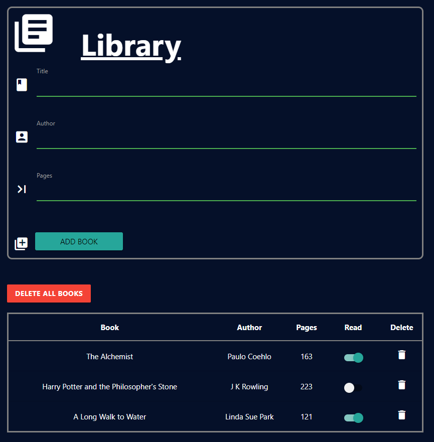

# A Library of all the books you've read
<!-- PROJECT LOGO -->
 

   

  

    <strong>World's best online Library</strong>
     
    <a href="https://mohammad-afsari.github.io/library/">View Demo</a>
    ·
    <a href="https://github.com/Mohammad-Afsari/library/issues">Report Bug</a>
    ·
    <a href="https://github.com/Mohammad-Afsari/library/issues">Request Feature</a>
  

<!-- ABOUT THE PROJECT -->
## About The Project

This project involved developing a library for users to store their information about the books they have or are about to read. 

### Built With
* HTML
* CSS
* Vanilla JavaScript
